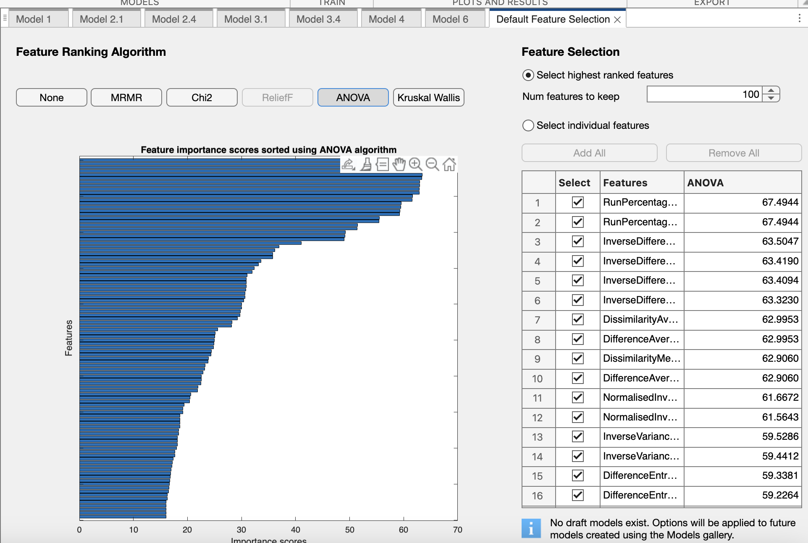
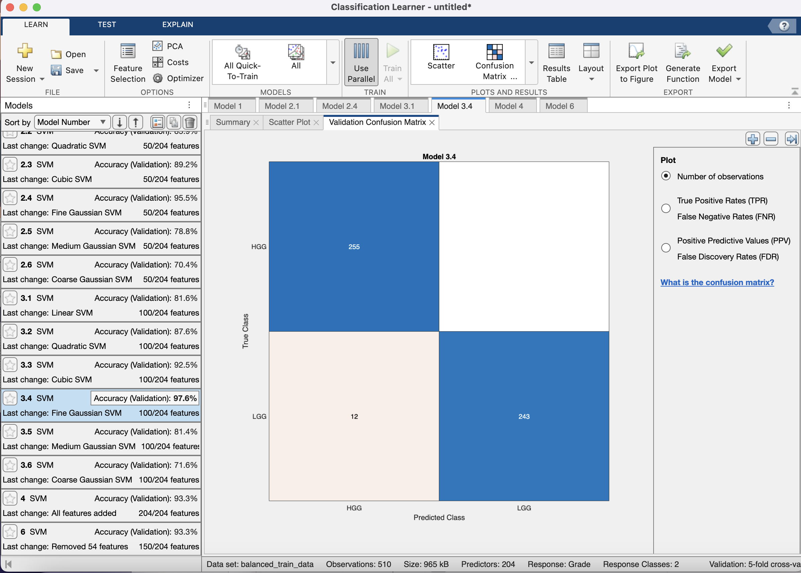
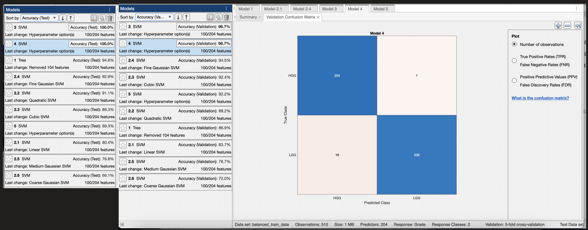

# CITS4402-project SVM Classification Model

For the step five of this project we are required to apply a Support Vector Machine (SVM) to classify the extracted features into categories of Low-Grade Gliomas (LGG) and High-Grade Gliomas (HGG). This classification task involves the extraction of relevant features from MRI scans, addressing class imbalance, and evaluating the effectiveness of the SVM classifier.

We have considered using either conventional features or radiomic features and decided that conventional features would not be desireable as the three features are proportional to each other and the model tested has an accuracy of only 72.7%.

To find the suitable radiomic features to use, we have extracted all the features available from the MATLAB functions, set the responsive value to the grades (LGG and HGG) and trained the SVM model.

## Data Partition

To train and validate the SVM classifier, the dataset was divided into a training set, a validation set, and a hidden testing set. Specifically:

- Initially 10 LGG patients and 10 HGG patients were assigned to the hidden testing set. However because the MATLAB classification learner requires the predictors of test set to be consistent with that of the training set and it is very difficult to keep track of the large number of predictors in the learner interface. As a result, we have used the learner app's function to automatically divide a hidden test set that is 10% of the input data for the second training session.
- Class imbalance between LGG and HGG patients was addressed by oversampling LGG data and generate synthetic samples to balance the sample size of each grade.
- Some data were found to be Inf (infinity) or very large, therefore we have replaced the Inf with NaN (Not a Number) and standardized the data by rescaling to have a mean of 1 and a standard deviation to avoid any numerical instability and learning bias.
- The remaining dataset was used for training and validation, using cross-validation with five folds to ensure robust model evaluation and protect against overfitting.

## Features used for training

The features used for training the SVM classifier were extracted from the MRI scans and included intensity, shape, and texture features. These features were selected based on their relevance to distinguishing between LGG and HGG. Feature selection was performed to identify the most discriminative features, and these were used to train the SVM classifier.

Using all 204 radiomic features can be potentially computationally expensive and not necessarily yields the highest accuracy, and a range of feature selection algorithms were used and filtered out the most important features. Through repeated training, we found that only the 100 most significant features were needed to produce our best model 3.4.

## Accuracy of model in classifying the MRI images during training, validation, and testing

The effectiveness of the SVM classifier was evaluated based on its accuracy during training, validation, and testing phases. The accuracy was calculated as follows:

$$
\text{Accuracy} = \frac{\text{Number of correct classifications}}{\text{Total number of classifications}}
$$

- **Validation Accuracy**: The accuracy on the validation set, used to tune hyperparameters and prevent overfitting. For the first training session, we have the model trained with a fine Gaussian SVM on 100 most significant features and got the validation accuracy of 97.6% as shown in second image. For second training session we used 90% of the balanced training set for training/validating, and the model trained with fine Gaussian SVM with the same featues but we also tried a box constraint level of 3 and 5, but the validation result is 96.7% for both of them.
- **Testing Accuracy**: The accuracy on the hidden testing set, providing an unbiased evaluation of the classifier's performance on unseen data. We only had a hidden test set of 10% of the input balanced training set for the second session for reason explained above. This model achieved a suprising 100.0% on the test set as shown in the third image.

## Discussion of SVM's accuracy with regard to feature selection

Feature selection plays a crucial role in the performance of the SVM classifier. The selected features should be highly discriminative to enable the classifier to distinguish effectively between LGG and HGG.

Using repeatability as the sole criterion for feature selection may not be sufficient. While repeatability ensures that features are consistently measured, it does not necessarily imply that they are the most discriminative for classification. Other criteria, such as relevance to the classification task, statistical significance, and robustness to noise, should also be considered to ensure the selection of the most effective features. As calculated by the feature selection algorithms, the top 30 repeatable radiomic features may not get a high score in being most significant or discriminant.

## Challenges during the classification process

Several challenges arised during the classification process:

- **Approaching the problem**: The problem seemed complicated and intimidating at the first glance, but we have found a very useful toolbox in MATLAB for training SVM models which abstracts away the coding problem for us to concentrate on the actual design of the model training.
- **Class Imbalance**: The dataset had a significant class imbalance between LGG and HGG patients, which can lead to biased classification results. This was addressed through oversampling the LGG group to mitigate any learning bias.
- **Feature Selection**: Identifying the most relevant features for classification was challenging due to the high dimensionality of the feature space and the need to avoid overfitting.
- **Model Validation and testing**: Ensuring the SVM classifier generalizes well to unseen data required careful validation and tuning of hyperparameters.
- **Computational Complexity**: Training the SVM classifier, especially with large feature sets and cross-validation, was computationally intensive, and preparing the data is very time consuming.
